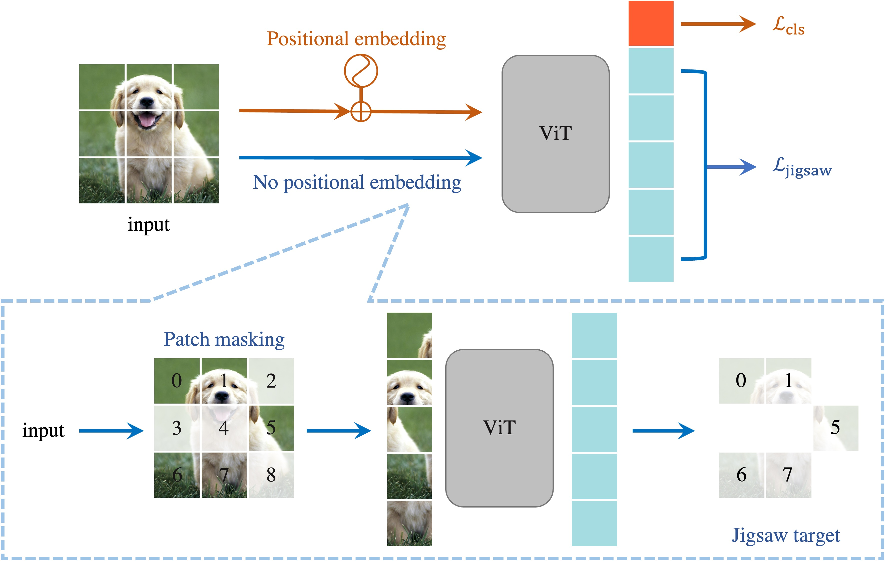

# Jigsaw-ViT
PyTorch implementation of **Jigsaw-ViT**, accepted by *Pattern Recognition Letters (2022)*:

**Jigsaw-ViT: Learning Jigsaw Puzzles in Vision Transformer**

by *[Yingyi Chen](https://github.com/yingyichen-cyy), [Xi Shen](https://xishen0220.github.io/), [Yahui Liu](https://yhlleo.github.io/), [Qinghua Tao](https://www.esat.kuleuven.be/stadius/person.php?id=2167), [Johan A.K. Suykens](https://www.esat.kuleuven.be/sista/members/suykens.html)*


[[arXiv](https://arxiv.org/abs/2207.11971)]
[[PDF](https://www.sciencedirect.com/science/article/pii/S0167865522003920)] 
[[Project Page](https://yingyichen-cyy.github.io/Jigsaw-ViT/)]

</img>

If our project is helpful for your research, please consider citing :
``` 
@article{chen2022jigsaw,
  author={Chen, Yingyi and Shen, Xi and Liu, Yahui and Tao, Qinghua and Suykens, Johan A. K.},
  title={Jigsaw-ViT: Learning Jigsaw Puzzles in Vision Transformer},
  journal={Pattern Recognition Letters},
  year={2022},
  publisher={Elsevier}
}
```

## Table of Content
* [1. Installation](#1-installation)
* [2. Model Zoo](#2-model-zoo)
* [3. Get Started on ImageNet](#3-get-started-on-imagenet)
  * [3.1 Data Preparation](#31-data-preparation)
  * [3.2 Training](#32-training)
  * [3.3 Evaluation](#33-evaluation)
* [4. Get Started on Noisy label Datasets](#4-get-started-on-noisy-label-datasets)
  * [4.1 Data Preparation](#41-data-preparation)
  * [4.2 Training](#42-training)
  * [4.3 Evaluation](#43-evaluation)
* [5. Get Started on Adversarial Examples](#5-get-started-on-adversarial-examples)
  * [5.1 In Black-box Settings](#51-in-black-box-settings)
  * [5.2 In White-box Settings](#52-in-white-box-settings)
* [6. Acknowledgement](#6-acknowledgement)

## 1. Installation
Firtst, clone the repository locally:
``` Bash
git clone https://github.com/yingyichen-cyy/JigsawViT.git
``` 
Then, install PyTorch 1.7.1 and torchvision 0.8.2 and timm, einops, munch:
``` Bash
conda create -n jigsaw-vit
conda activate jigsaw-vit
conda install pytorch==1.7.1 torchvision==0.8.2 torchaudio==0.7.2 cudatoolkit=11.0 -c pytorch
pip install timm==0.4.12
pip install einops
pip install munch
``` 
For experiments on Swin backbone, please refer to [here](https://github.com/microsoft/Swin-Transformer/blob/main/get_started.md) for setting environment.

## 2. Model Zoo
We release our *jigsaw models* with different backbones.

### ImageNet-1K
Models with DeiT backbones are trained from scratch for <strong>300 epochs</strong>.
Models with Swin backbones are finetuned base on the official pretrained checkpoints on ImageNet-22K for <strong>30 epochs</strong> as in https://github.com/microsoft/Swin-Transformer.
<table>
  <tr>
    <th>backbone</th>
    <th>resolution</th>
    <th>#params</th>
    <th>pretrain</th>
    <th>Baseline acc@1</th>
    <th>Jigsaw-ViT acc@1</th>
    <th>Download</th>
  </tr>
  <tr>
    <td>DeiT-S/16</td>
    <td>224x224</td>
    <td>22M</td>
    <td>-</td>
    <td>79.8</td>
    <td><strong>80.5</strong></td>
    <td><a href="https://drive.google.com/file/d/1jlIJN7Kr_IdEz3qNXHGThr9e11De0sDy/view?usp=share_link">model</a></td>
  </tr>
  <tr>
    <td>DeiT-B/16</td>
    <td>224x224</td>
    <td>86M</td>
    <td>-</td>
    <td>81.8</td>
    <td><strong>82.1</strong></td>
    <td><a href="https://drive.google.com/file/d/10hwCGL_LnWqokHcOwJWPxZ4q7anAG3ut/view?usp=share_link">model</a></td>
  </tr>
  <tr>
    <td>Swin-S</td>
    <td>224x224</td>
    <td>50M</td>
    <td><a href="https://github.com/SwinTransformer/storage/releases/download/v1.0.8/swin_small_patch4_window7_224_22k.pth">Swin-S ImageNet-22K</a></td>
    <td>83.2</td>
    <td><strong>83.6</strong></td>
    <td><a href="https://drive.google.com/file/d/1wg6RurcFloOKBgFFInfCuUbFE3IqXzSR/view?usp=share_link">model</a></td>
  </tr>
  <tr>
    <td>Swin-B</td>
    <td>224x224</td>
    <td>88M</td>
    <td><a href="https://github.com/SwinTransformer/storage/releases/download/v1.0.0/swin_base_patch4_window7_224_22k.pth">Swin-B ImageNet-22K</a></td>
    <td><strong>85.2</strong></td>
    <td>85.0</td>
    <td><a href="https://drive.google.com/file/d/1trqa7ZIiyDULPq3l_EqWWWV1Q78sObCK/view?usp=share_link">model</a></td>
  </tr>
</table>

### Clothing1M 
Note that Nested Co-teaching (NCT) [(Chen et al., 2022)](https://github.com/yingyichen-cyy/Nested-Co-teaching) is used for experiments on Clothing1M dataset. In the first stage of NCT, two independent models (base models) are trained from scratch on Clothing1M training set. In the second stage, two base models are finetuned together with Co-teaching.
<table>
  <tr>
    <th>Model</th>
    <th>backbone</th>
    <th>role</th>
    <th>acc@1</th>
    <th>Download</th>
  </tr>
  <tr>
    <td>Jigsaw-ViT</td>
    <td>DeiT-S/16</td>
    <td>NCT base model 1</td>
    <td>72.4</td>
    <td><a href="https://drive.google.com/file/d/1ZqfeMstHMkzjuPwsNmw_5aJNTGNgqSG1/view?usp=share_link">model</a></td>
  </tr>
  <tr>
    <td>Jigsaw-ViT</td>
    <td>DeiT-S/16</td>
    <td>NCT base model 2</td>
    <td>72.7</td>
    <td><a href="https://drive.google.com/file/d/122PYz7wHpBXsS_I3D7a9sve70uPMgiBz/view?usp=share_link">model</a></td>
  </tr>
  <tr>
    <td>Jigsaw-ViT+NCT</td>
    <td>DeiT-S/16</td>
    <td>NCT</td>
    <td>75.4</td>
    <td><a href="https://drive.google.com/file/d/1VeKmZjN98kBlyXWksyywMFEZiZ6EE5wb/view?usp=share_link">model</a></td>
  </tr>
  <tr>
    <td>Jigsaw-ViT+NCT*</td>
    <td>DeiT-S/16</td>
    <td>NCT</td>
    <td><strong>75.6</strong></td>
    <td><a href="https://drive.google.com/file/d/1B4ASQplUCas9iNi3nub5ktPP5mX6bHDh/view?usp=share_link">model</a></td>
  </tr>
</table>
* This is the current best Jigsaw-ViT+NCT model we have on Clothing1M.

## 3. Get Started on ImageNet

### 3.1 Data Preparation

Download and extract ImageNet train and val images from http://image-net.org/. 
Please refer to [here](https://gist.github.com/BIGBALLON/8a71d225eff18d88e469e6ea9b39cef4) for extraction commands.
The directory structure is the standard layout as in [DeiT](https://github.com/facebookresearch/deit/blob/main/README_deit.md), and the training and validation data is expected to be in the `train/` folder and `val/` folder respectively:
```
/path/to/imagenet/
  train/
    n01440764/
    n01755581/
    n02012849/
    ...
  val/
    n01440764/
    n01755581/
    n02012849/
    ...
```

### 3.2 Training

Go to the ImageNet folder
``` Bash
cd imagenet/
```
#### 3.2.1 DeiT as Backbone

To train Jigsaw-ViT with DeiT-Base/16 as backbone on a single node with 8 GPUs for 300 epochs run:
``` Bash
cd jigsaw-deit/
# run Jigsaw-ViT with DeiT-Base/16 backbone
python -m torch.distributed.launch --nproc_per_node=8 --use_env main_jigsaw.py --model jigsaw_base_patch16_224 --batch-size 128 --data-path ./imagenet --lambda-jigsaw 0.1 --mask-ratio 0.5 --output_dir ./jigsaw_base_results
```
Note that you can simply change to backbone DeiT-Small/16 by changing:
``` Bash
# run Jigsaw-ViT with DeiT-Small/16 backbone
python -m torch.distributed.launch --nproc_per_node=8 --use_env main_jigsaw.py --model jigsaw_small_patch16_224 --batch-size 128 --data-path ./imagenet --lambda-jigsaw 0.1 --mask-ratio 0.5 --output_dir ./jigsaw_small_results
```
Please refer to [/imagenet/jigsaw-deit/bashes/](https://github.com/yingyichen-cyy/JigsawViT/blob/master/imagenet/jigsaw-deit/bashes) for more details.

#### 3.2.2 Swin as Backbone

To finetune Jigsaw-ViT with [ImageNet-22K pretrained](https://github.com/SwinTransformer/storage/releases/download/v1.0.0/swin_base_patch4_window7_224_22k.pth) Swin-Base as backbone on a single node with 8 GPUs for 30 epochs run:
``` Bash
cd jigsaw-swin
# fine-tune a Jigsaw-Swin-B model pre-trained on ImageNet-22K(21K):
bash ./bashes/run_jigsaw_swin_base.sh
```
To finetune Jigsaw-ViT with [ImageNet-22K pretrained](https://github.com/SwinTransformer/storage/releases/download/v1.0.8/swin_small_patch4_window7_224_22k.pth) Swin-Small as backbone on a single node with 8 GPUs for 30 epochs run:
``` Bash
# fine-tune a Jigsaw-Swin-S model pre-trained on ImageNet-22K(21K):
bash ./bashes/run_jigsaw_swin_small.sh
```
Please refer to [/imagenet/jigsaw-swin/bashes/](https://github.com/yingyichen-cyy/JigsawViT/tree/master/imagenet/jigsaw-swin/bashes) for more details.

### 3.3 Evaluation
For evaluation of the Jigsaw-ViT model, please first download our model from [here](https://drive.google.com/file/d/10hwCGL_LnWqokHcOwJWPxZ4q7anAG3ut/view?usp=share_link).
``` Bash
cd /imagenet/jigsaw-deit
# please change --model, --data-path and --resume accordingly.
python main_jigsaw.py --eval --model jigsaw_base_patch16_224 --resume ./jigsaw_base_results/best_checkpoint.pth --data-path ./imagenet
```
For evaluation of the Jigsaw-Swin model, please first download our model from [here](https://drive.google.com/file/d/1trqa7ZIiyDULPq3l_EqWWWV1Q78sObCK/view?usp=share_link).
``` Bash
cd /imagenet/jigsaw-swin
# please change --cfg, --data-path and --resume accordingly.
python -m torch.distributed.launch --nproc_per_node 2 --master_port 12345 main_jigsaw.py --eval --cfg configs/jigsaw_swin/jigsaw_swin_base_patch4_window7_224_22kto1k_finetune.yaml --resume ./jigsaw_swin_base_patch4_window7_224_22kto1k_finetune/ckpt_best.pth --data-path ./imagenet
```

## 4. Get Started on Noisy label Datasets

### 4.1 Data Preparation
Please refer to the following links for downloading and preprossing the datasets.
<table>
  <tr>
    <th>Dataset</th>
    <th>download and preprocess</th>
  </tr>
  <tr>
    <td><a href="http://proceedings.mlr.press/v97/song19b/song19b.pdf">Animal-10N</a></td>
    <td><a href="https://github.com/yingyichen-cyy/JigsawViT/blob/master/noisy-label/data/animal.sh">/noisy-label/data/animal.sh</a></td>
  </tr>
  <tr>
    <td><a href="https://arxiv.org/abs/1711.07131">Food-101N</a></td>
    <td><a href="https://github.com/yingyichen-cyy/JigsawViT/blob/master/noisy-label/data/food101n.sh">/noisy-label/data/food101n.sh</a></td>
  </tr>
  <tr>
    <td><a href="https://openaccess.thecvf.com/content_cvpr_2015/papers/Xiao_Learning_From_Massive_2015_CVPR_paper.pdf">Clothing1M</a></td>
    <td><a href="https://github.com/yingyichen-cyy/JigsawViT/blob/master/noisy-label/data/clothing.sh">/noisy-label/data/clothing.sh</a></td>
  </tr>
</table>

### 4.2 Training
Go to the noisy-label folder
``` Bash
cd noisy-label/
```
#### 4.2.1 Training of Jigsaw-ViT
We train one Jigsaw-ViT for each dataset. The model can be trained on 2 NVIDIA Tesla P100-SXM2-16GB GPUs.
Please refer to the following links for training details.
<table>
  <tr>
    <th>Dataset</th>
    <th>download and preprocess</th>
  </tr>
  <tr>
    <th>Animal-10N</th>
    <td><a href="https://github.com/yingyichen-cyy/JigsawViT/blob/master/noisy-label/jigsaw-vit/bashes/Animal10N_eta2_mask02.sh">/noisy-label/jigsaw-vit/bashes/Animal10N_eta2_mask02.sh</a></td>
  </tr>
  <tr>
    <th>Food-101N</th>
    <td><a href="https://github.com/yingyichen-cyy/JigsawViT/blob/master/noisy-label/jigsaw-vit/bashes/Food101N_eta1_mask05.sh">/noisy-label/jigsaw-vit/bashes/Food101N_eta1_mask05.sh</a></td>
  </tr>
  <tr>
    <th>Clothing1M</th>
    <td><a href="https://github.com/yingyichen-cyy/JigsawViT/blob/master/noisy-label/jigsaw-vit/bashes/Clothing1M_eta2_mask01.sh">/noisy-label/jigsaw-vit/bashes/Clothing1M_eta2_mask01.sh</a></td>
  </tr>
</table>
For example:

``` Bash
mkdir LabelNoise_checkpoint
# please change --data-path accordingly
bash bashes/Animal10N_eta2_mask02.sh
```

#### 4.2.2 Training of Jigsaw-ViT+NCT
To finetune Jigsaw-ViT+NCT on Clothing1M where NCT is the [Nested Co-teaching](https://github.com/yingyichen-cyy/Nested-Co-teaching), we first download the two base trained Jigsaw-ViT models from [NCT base model 1](https://drive.google.com/file/d/1ZqfeMstHMkzjuPwsNmw_5aJNTGNgqSG1/view?usp=share_link), [NCT base model 2](https://drive.google.com/file/d/122PYz7wHpBXsS_I3D7a9sve70uPMgiBz/view?usp=share_link).

Then, we finetune Jigsaw-ViT+NCT on Clothing1M:
``` Bash
cd jigsaw-vit-NCT
mkdir finetune_nested
# please change --data-path and --resumePthList accordingly in run_finetune.sh
bash run_finetune.sh
```
### 4.3 Evaluation
For evaluation of the Jigsaw-ViT model, please first download our best model from [here](https://drive.google.com/file/d/1ZqfeMstHMkzjuPwsNmw_5aJNTGNgqSG1/view?usp=share_link).
``` Bash
cd noisy-label/jigsaw-vit
# Please change "--data-path" and "--resumePth" to your own paths
python3 eval.py --data-path ../data/Clothing1M/ --data-set Clothing1M --arch vit_small_patch16 --resumePth ./pretrained/Clothing1M_eta1_iter400k_wd005_mask025_smallP16_aug_warm20k_Acc0.724 --gpu 0
```
For evaluation of the Jigsaw-ViT+NCT model, please first download our best model from [here](https://drive.google.com/file/d/1B4ASQplUCas9iNi3nub5ktPP5mX6bHDh/view?usp=share_link).
Then please follow:
``` Bash
cd noisy-label/jigsaw-vit-NCT
# Please change "--data-path" and "--resumePth" to your own paths
python3 eval.py --data-path ../data/Clothing1M/ --data-set Clothing1M --arch vit_small_patch16 --resumePth ./finetune_nested/Clothing1M_eta1_iter50k_wd005_mask075_smallP16_aug_bs96_warm0_fgr0.2_lr5e-5_nested100_Acc0.756 --best-k 34 --gpu 0
```

## 5. Get Started on Adversarial Examples
We compare DeiT-S/16 and Jigsaw-ViT with the same backbone on adversarial examples. Both models are trained on ImageNet-1K from scratch and checkpoints are provided: [Jigsaw-ViT](https://drive.google.com/file/d/1jlIJN7Kr_IdEz3qNXHGThr9e11De0sDy/view?usp=share_link), [DeiT-S/16](https://drive.google.com/file/d/1j4LG74t1NzgtSwzhIGiI6Tj--Vb92RTB/view?usp=share_link).

### 5.1 In Black-box Settings
Please go to [adversarial-examples/bashes/run_transfer_attack.sh](https://github.com/yingyichen-cyy/JigsawViT/blob/master/adversarial-examples/bashes/run_transfer_attack.sh) for black-box attacks. Here is one example:
``` Bash
cd adversarial-examples
# please change --data-path and --resumePth1, --resumePth2 accordingly.
# ViT-S/16 as surrogate model
python3 transfer_attack.py --arch vit --attack-type FGSM --data-path ./data/imagenet/ --resumePth1 ./pretrained/imagenet-deit_small_patch16_224-org-acc78.85.pth --resumePth2 ./pretrained/imagenet-deit_small_patch16_224-jigsaw-eta0.1-r0.5-acc80.51.pth --gpu 0
# ResNet-152 as surrogate model
python3 transfer_attack.py --arch resnet152 --attack-type FGSM --data-path ./data/imagenet/ --resumePth1 ./pretrained/imagenet-deit_small_patch16_224-org-acc78.85.pth --resumePth2 ./pretrained/imagenet-deit_small_patch16_224-jigsaw-eta0.1-r0.5-acc80.51.pth --gpu 0
```
Note that for square attack, which is a black-box attack, we write it in white_attack.py only for convenience.
Commands can be found in [/adversarial-examples/bashes/run_square_attack.sh](https://github.com/yingyichen-cyy/JigsawViT/blob/master/adversarial-examples/bashes/run_square_attack.sh).

### 5.2 In White-box Settings
Please go to [/adversarial-examples/bashes/run_white.sh](https://github.com/yingyichen-cyy/JigsawViT/blob/master/adversarial-examples/bashes/run_white.sh) for black-box attacks. Here is one example:
``` Bash
# please change --data-path and --resumePth accordingly.
python3 white_attack.py --attack-type FGSM --eps 0.125 --data-path ./data/imagenet/ --resumePth ./pretrained/imagenet-deit_small_patch16_224-org-acc78.85.pth --gpu 0
python3 white_attack.py --attack-type FGSM --eps 0.125 --data-path ./data/imagenet/ --resumePth ./pretrained/imagenet-deit_small_patch16_224-jigsaw-eta0.1-r0.5-acc80.51.pth --gpu 0
```

## 6. Acknowledgement
This repository is based on the official codes of [DeiT](https://github.com/facebookresearch/deit), [Swin](https://github.com/microsoft/Swin-Transformer), [MAE](https://github.com/facebookresearch/mae), [Nested Co-teaching](https://github.com/yingyichen-cyy/Nested-Co-teaching) and [Adversarial-Attacks-PyTorch](https://github.com/Harry24k/adversarial-attacks-pytorch).
